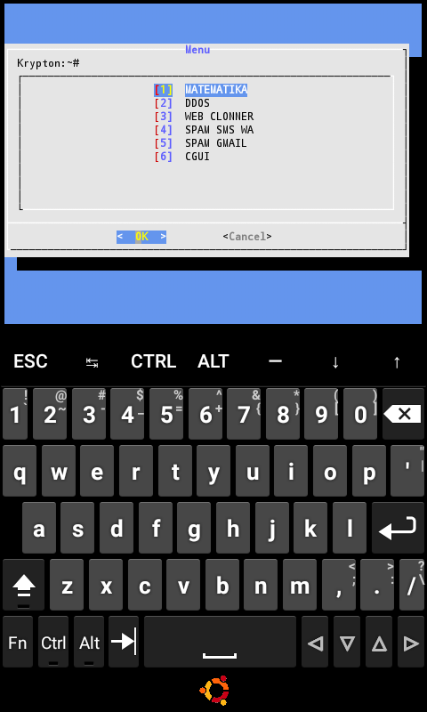

# GTOOL
pkg install python2 
pkg install python 
pkg install git 
pkg install dialog 
pkg install bc  
pip2 install mailfree 
pip2 install requests 
git clone https://github.com/puja04122003/GTOOL 
cd GTOOL 
python2 main.py 

<b>#tools serbaguna dengan tampilan mirip komputer di era 90 an </b>
