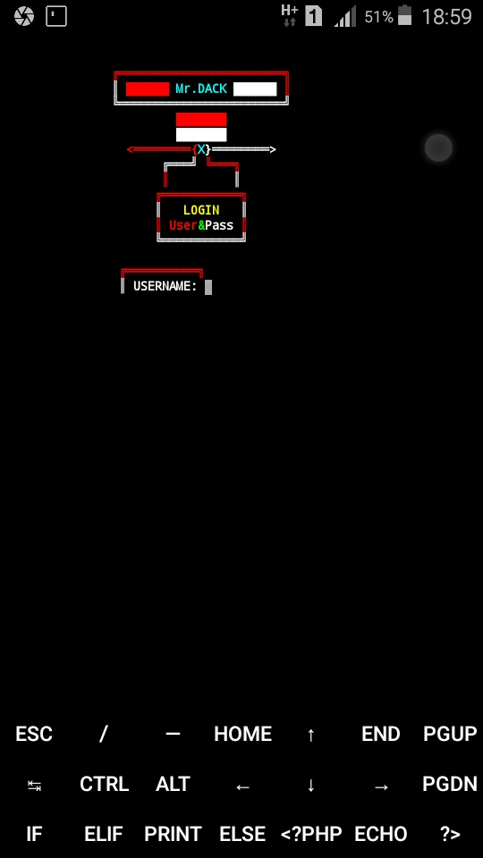
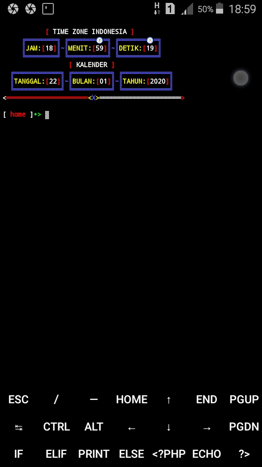

#  [ Termux-Login ]

Termux-Login Tools for created Login in termux.

# [ feature Termux-Login ]
- [x] Home-Login
- [x] Home-Termux
- [x] Key-Termux
- [x] Suport-Python3

# [ Installation ]
```
$ pkg update upgrade
$ pkg install python git
$ git clone https://github.com/DH4CK1/Termux-Login
$ cd Termux-Login
$ python login-termux.py
```
# [ Images ]
Home-Login: <br>
<br>
Home-bash: <br>
<br>

# [ Thanks to]
Mr.Tr3v!0n <br>
https://github.com/Rusmana-ID <br>
Black Coder Crush <br>
https://github.com/Blackcodercrush
# [ Note ]
Check my other repository <a href="https://github.com/DH4CK1?tab=repositories">here</a>

